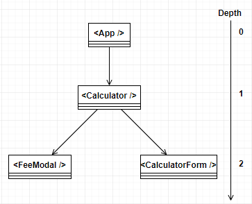

## Project description
Preliminary assignment for software engineering intern position at Wolt. The task was to build a frontend delivery fee calculator app using React and TypeScript. A delivery fee is calculated based on user input and is shown to the user. Full description [here](https://github.com/woltapp/engineering-summer-intern-2023/blob/main/README.md).

The application is deployed to [fly.io](https://falling-forest-2596.fly.dev/) through GitHub Actions.

## How to start the application locally

### 1. Clone the repository to your local machine
- Prerequisites:
  - `git`
- Clone the repository in terminal with `git clone https://github.com/joelhackinen/deliveryfee.git`

Now there are two different ways to proceed from here:
#### Using docker-compose
- Prerequisities:
  - `Docker`
  - `docker-compose`
- At the root of the project run terminal command `docker-compose up -d --build` to build and run the production image as a container in the background. The app will be running at `localhost:8000`.
- You can also run it in development mode with `docker-compose -f docker-compose.dev.yml up -d --build` with hot reloading enabled. The app is running at `localhost:3000`.
- Stop the container with `docker-compose down`.

#### OR using npm
- Prerequisities:
  - `Node`
  - `npm`
- Run `npm install` at the root of the project to install all the dependencies.
- Use command `npm start` to run the application.
- The app is running at `localhost:3000`.

### 2. Pull the image from Docker Hub and run as a local container
- Prerequisities:
  - `Docker`
- The latest image is automatically updated to Docker Hub through a simple GitHub Actions pipeline.
- Run with `docker run -p 8000:80 joelhackinen/deliveryfee:latest`.
- The app is running at `localhost:8000`.
- Stop the container with `docker container stop`

## Tests
- Run terminal command `npm install` if you haven't already.
- `npm run test` to run the tests.

The tests are emphasized on testing the input validation and fee calculation, which are the most important features of the application. 

## Technology choices
- React
  - requirement
- TypeScript
  - requirement
- React-Bootstrap
  - simple UI-framework which hardly requires any boilerplate code
  - keeps the code maintainable and readable and provides all the necessary tools to make clear and responsive interfaces
- Docker and docker-compose
  - facilitates application development and deployment
  - makes the reviewing of the project easier
- Jest and react-testing-library
  - simple testing frameworks for testing functions and components
- GitHub Actions
  - facilitates the CI/CD pipeline
  - after new pull request or push main-branch goes through the tests and the app is deployed to docker hub and fly.io

As the application state needs to be accessed only from the depth of two component layers (picture below), the use of any global state management tools is not justified. All the necessary stage management is handled with React's built-in useState-hook and the information between the components is passed as props.

## Todos and things I want to improve
- optimize deploy.Dockerfile
  - fly.io doesn't support multi-staging? nginx might also be the trouble
  - at the moment the image in docker hub is more optimized than the one used in deploying
- fix the npm warnings
- more tests, maybe e2e
- enhance the UI and fix sizing for different devices
  - maybe some other UI library would have been fancier
- use some library to handle forms, such as Formik
- make own components for input fields as the code is a little repetitive there